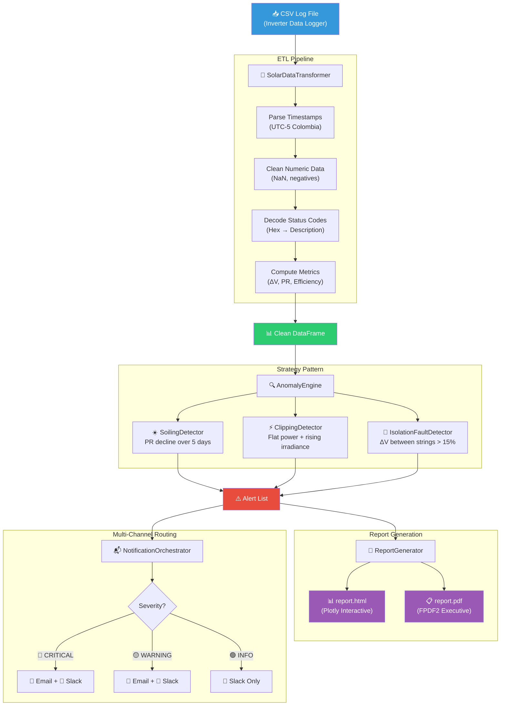
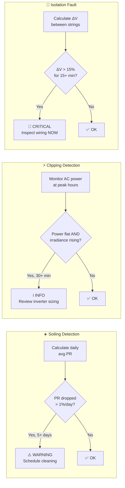
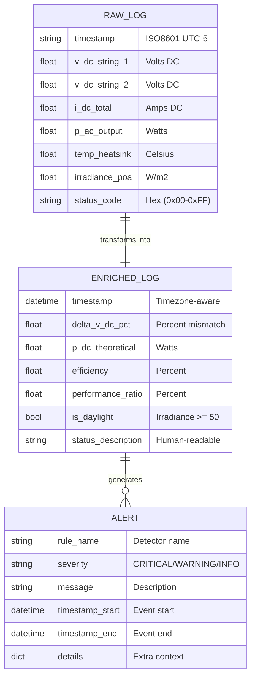

# Data Flow Diagram — `pv-report-automation`

## Pipeline Flow

```mermaid
flowchart TD
    A["📥 CSV Log File<br/>(Inverter Data Logger)"] --> B["🔄 SolarDataTransformer"]

    subgraph ETL["ETL Pipeline"]
        B --> B1["Parse Timestamps<br/>(UTC-5 Colombia)"]
        B1 --> B2["Clean Numeric Data<br/>(NaN, negatives)"]
        B2 --> B3["Decode Status Codes<br/>(Hex → Description)"]
        B3 --> B4["Compute Metrics<br/>(ΔV, PR, Efficiency)"]
    end

    B4 --> C["📊 Clean DataFrame"]
    C --> D["🔍 AnomalyEngine"]

    subgraph Detection["Strategy Pattern"]
        D --> D1["☀️ SoilingDetector<br/>PR decline over 5 days"]
        D --> D2["⚡ ClippingDetector<br/>Flat power + rising irradiance"]
        D --> D3["🔌 IsolationFaultDetector<br/>ΔV between strings > 15%"]
    end

    D1 --> E["⚠️ Alert List"]
    D2 --> E
    D3 --> E

    E --> F["📄 ReportGenerator"]
    E --> G["📬 NotificationOrchestrator"]

    subgraph Reports["Report Generation"]
        F --> F1["📊 report.html<br/>(Plotly Interactive)"]
        F --> F2["📋 report.pdf<br/>(FPDF2 Executive)"]
    end

    subgraph Alerts["Multi-Channel Routing"]
        G --> G1{"Severity?"}
        G1 -->|"🔴 CRITICAL"| G2["📧 Email + 💬 Slack"]
        G1 -->|"🟡 WARNING"| G3["📧 Email + 💬 Slack"]
        G1 -->|"🟢 INFO"| G4["💬 Slack Only"]
    end

    style A fill:#3498DB,color:#fff
    style C fill:#2ECC71,color:#fff
    style E fill:#E74C3C,color:#fff
    style F1 fill:#9B59B6,color:#fff
    style F2 fill:#9B59B6,color:#fff
```

## Anomaly Detection Rules

```mermaid
flowchart LR
    subgraph Soiling["☀️ Soiling Detection"]
        S1["Calculate daily<br/>avg PR"] --> S2{"PR dropped<br/>> 1%/day?"}
        S2 -->|"Yes, 5+ days"| S3["⚠️ WARNING<br/>Schedule cleaning"]
        S2 -->|"No"| S4["✅ OK"]
    end

    subgraph Clipping["⚡ Clipping Detection"]
        C1["Monitor AC power<br/>at peak hours"] --> C2{"Power flat AND<br/>irradiance rising?"}
        C2 -->|"Yes, 30+ min"| C3["ℹ️ INFO<br/>Review inverter sizing"]
        C2 -->|"No"| C4["✅ OK"]
    end

    subgraph Isolation["🔌 Isolation Fault"]
        I1["Calculate ΔV<br/>between strings"] --> I2{"ΔV > 15%<br/>for 15+ min?"}
        I2 -->|"Yes"| I3["🔴 CRITICAL<br/>Inspect wiring NOW"]
        I2 -->|"No"| I4["✅ OK"]
    end
```

## Data Schema

```mermaid
erDiagram
    RAW_LOG {
        string timestamp "ISO8601 UTC-5"
        float v_dc_string_1 "Volts DC"
        float v_dc_string_2 "Volts DC"
        float i_dc_total "Amps DC"
        float p_ac_output "Watts"
        float temp_heatsink "Celsius"
        float irradiance_poa "W/m2"
        string status_code "Hex (0x00-0xFF)"
    }

    ENRICHED_LOG {
        datetime timestamp "Timezone-aware"
        float delta_v_dc_pct "Percent mismatch"
        float p_dc_theoretical "Watts"
        float efficiency "Percent"
        float performance_ratio "Percent"
        bool is_daylight "Irradiance >= 50"
        string status_description "Human-readable"
    }

    ALERT {
        string rule_name "Detector name"
        string severity "CRITICAL/WARNING/INFO"
        string message "Description"
        datetime timestamp_start "Event start"
        datetime timestamp_end "Event end"
        dict details "Extra context"
    }

    RAW_LOG ||--|| ENRICHED_LOG : "transforms into"
    ENRICHED_LOG ||--o{ ALERT : "generates"
```
